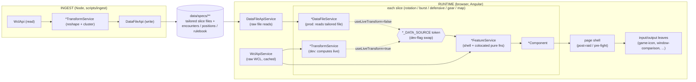

# warcraft-learner architecture & analysis design

## Analysis design principles

- **All findings are bench-driven; always assume complete ingested data.** Every analysis finding derives from the top-parse bench data for the specific encounter+spec. Do not add fallbacks, null guards, or special-case code for missing bench data - if data is absent that is an ingestion problem, not an analysis problem. This applies to lost-cast detection, held-past-reset, opener delay, and any future findings.

## URL routing

Selection is **not** persisted in the URL and pages do **not** auto-run from query params. This is a
deliberate anti-abuse measure: because the browser holds the WCL client-credentials secret and shares one
account-level rate-limit budget with ingestion, a crawler following a shared `?report=...` deep-link used
to auto-run a full (expensive) analysis on load and drain that budget. Removing URL-driven loading closes
that vector. Sticky state lives in localStorage instead (`core/services/selection-store.ts`): the
post-raid player **name** and the pre-fight **spec**. Everything else is re-entered.

### Player page (`/`)
A report is loaded only by an explicit **Analyze** action (or Enter) on a **validated** report reference -
a full WCL report URL or a bare 16-character report code (`isValidReportCode` in `post-raid.ts`). The
Analyze button stays disabled, and **no** WCL request fires, until the input is a valid code. There is no
report/fight/player query param and nothing auto-loads on page open. The sticky player name re-selects the
same character once a log loads.

### Pre-fight page (`/pre`)
Spec + encounter selector; all data is static (ingested bench data), no character or log required. There
is no `spec`/`encounter` query param. The last spec is restored from localStorage; the encounter is
re-selected each visit.

## Directory map (full)

```
warcraft-learner/
├── frontend/                   # The entire application - Angular 22
│   ├── src/app/
│   │   ├── pages/
│   │   │   ├── post-raid/      # Main player analyzer (/)
│   │   │   ├── pre-fight/      # Pre-fight gear check (/pre)
│   │   │   └── live/           # Live analysis - polls for new pulls (/live)
│   │   └── core/
│   │       ├── services/                  # The two runtime API services + plumbing
│   │       │   ├── wcl-api.ts             # WCL transport (raw events/report/rankings, cached, pass-through)
│   │       │   ├── data-file-api.ts       # Pass-through reader of data/specs/** (incl. getSlice)
│   │       │   ├── live-report-sync.ts    # Polling timer / visibility service
│   │       │   ├── wcl-queries.ts         # GraphQL strings + typed *Vars interfaces
│   │       │   └── wcl-auth.ts            # Client-credentials token (embedded secret)
│   │       ├── data-source/               # provide-data-source.ts (file/live DI swap)
│   │       └── models/                    # TypeScript interfaces
│   │   # Each card under pages/post-raid/{rotation,burst-windows,defensive,gear,map}/ is a
│   │   # self-contained slice: *-data-source.ts (token) + *-data-file.service.ts +
│   │   # *-transform.service.ts + *.service.ts (feature shell) + component. /pre reuses them.
│   ├── public/
│   │   └── data/specs/         # Static data files - served as assets
│   │       ├── index.json              # Spec manifest: [{spec, encounter_count}] (generated by ingestion)
│   │       └── {Spec}/
│   │           ├── rulebook.json       # AI-generated rulebook
│   │           ├── guides.json         # Guide list with scraped content
│   │           ├── encounters.json     # Index: [{id, name, sample_count}]
│   │           ├── {slice}/             # Per-slice tailored file: {burst,rotation,defensive,gear}/{enc_id}.json
│   │           └── positions/
│   │               └── {enc_id}.json  # Top-parse position timelines (map feature)
│   └── scripts/                # Node.js CLI tools (TypeScript, run via tsx; no server needed)
│       ├── ingest/                  # Ingestion orchestrator + discovery-only modules + colocated *.spec.ts tests
│       │   ├── orchestrator.ts      # Entry: boots Angular runtime, drives the 5 transform services, writes tailored files
│       │   ├── angular-runtime.ts   # Boots jsdom + Angular TestBed injector; provides Node transports; returns transform services + WclApiService + DataFileApiService
│       │   ├── node-wcl-transport.ts        # FetchWclTransport - plain fetch GraphQL, in-run cache
│       │   ├── node-data-file-transport.ts  # FsDataFileTransport - fs read/write/list
│       │   ├── ingest-version.ts    # INGEST_VERSION: manual integer folded into the skip-signature + stamped on each file
│       │   ├── signature.ts         # source_signature + ingest_version compute/compare (signature-skip)
│       │   ├── git-mtime.ts         # Git last-commit time of a spec's data dir (work-ordering)
│       │   ├── ordering.ts          # Spec/encounter work-ordering (empty -> old-version -> current, oldest git-time within)
│       │   ├── wcl-fetchers.ts      # Discovery: getEncounters (worldData + rankings liveness probe)
│       │   ├── wcl-client.ts        # Discovery: WclQueryClient interface + EventFetchOptions + BudgetExceededError
│       │   ├── wcl-queries.ts       # Discovery: RATE_LIMIT_QUERY, ENCOUNTERS_QUERY, RANKINGS_QUERY (+ RankingsQueryVars)
│       │   ├── wcl-mappers.ts       # Discovery: SPEC_TO_WCL, mapRankings, filterEncounters, groupEncountersByZone, exclude patterns
│       │   └── models/              # wcl.models.ts: the ingest WCL shapes
│       ├── build-rulebook.ts   # Rulebook management (build prompt, save AI output)
│       └── scrape-guides.ts    # Re-scrape all guides (default); add one via --spec/--url
├── prompts/
│   └── rulebook_skill.md       # LLM prompt template for rulebook generation
├── .github/workflows/
│   ├── deploy-pages.yml         # Build Angular --base-href /warcraft-learner/ -> GitHub Pages (push to main)
│   ├── ingest-parses.yml        # Hourly via an external cron-job.org workflow_dispatch trigger (GitHub's own schedule cron was too unreliable) + manual: runs `npm run scrape` then `npm run ingest`, commits data/specs/**
│   ├── pr-preview.yml           # Per-PR preview deploy
│   ├── pr-preview-cleanup.yml   # Tear down preview when PR closes
│   └── test.yml                 # CI: lint + tests
```

**Data location**: `frontend/public/data/specs/` - Angular's `public/` directory serves these at `/data/specs/` in both the dev server and the built app.

**Build output** (`static/angular/`) is gitignored - rebuilt by `deploy-pages.yml` on every push to `main`.

## Architecture: layers & rules (vertical-slice target)

The app is built as **per-use-case vertical slices** (map / burst / rotation / defensive / gear). Each slice is independent and follows the same shape; the **Burst** slice (`pages/post-raid/burst-windows/`) is the reference implementation. All new work must follow these layer rules.

The data path is two symmetric pipelines that meet at the static data files:

```
INGEST (Node)                                        RUNTIME (browser)
WclApi (read, pass-through)                          WclApiService (read, pass-through, cached)
   -> *TransformService (the only transform)            DataFileApiService (read, pass-through)
   -> DataFileApi (write)  ->  data/specs/**  ->         -> *DataSource (DI token, dev-flag swap)
                                                         -> *FeatureService (runtime shell)
                                                         -> *Component -> page shell -> leaves
```



Reading the runtime graph: in production each slice's `*_DATA_SOURCE` resolves to its `*DataFileService` (reads the ingest-baked tailored file); under the `useLiveTransform` dev flag it resolves to the `*TransformService`, which recomputes the same bench live from WCL (no ingestion). Either way the `*FeatureService` reads that bench plus the player's own log (cached `WclApiService`) and produces the view-model; the page shell only resolves selection and composes cards.

**Layer rules (hard):**

- **Pass-through API services - exactly two at runtime.** `WclApiService` (raw WCL events/report/rankings/combatant-info/player-details) and `DataFileApiService` (raw static-file reads). They do **no** remapping or aggregation: bytes in, typed bytes out. Every response projection (rankings -> `ParseRanking`, combatant info -> `CharacterGear`, player details -> spec) is a small pure function colocated in the consuming slice/shell, not in the transport. There is no `wcl-mappers.ts` on the runtime side.
- **Self-contained services - import ONLY the two API services (or the slice `*DataSource` token) + models + `logWarn`.** Both the `*TransformService` and the `*FeatureService` follow this: no importing of outside analysis, mappers, or UI components. Each **reimplements/owns** its math as named, pure, **total** functions (returns `0`/`null`/`[]` for empty input, never throws; optional findings return `T | null`), **exported from and colocated in that service's own `*.service.ts`**, with no Angular/`inject()`/IO. Self-containment over sharing: the transform owns its own math and pulls nothing from outside analysis or mappers (ingestion runs this very service, so there is no second implementation to keep aligned). Data shapes a service needs (view-model rows like `ComparisonWindow`/`RangeRow`, ranking rows like `ParseRanking`) live in `core/models`, never in a component or mapper file. Tested directly in `*.service.spec.ts`. Cross-slice **presentational** derivations may still live under `shared/` (e.g. `shared/gear/gear-comparison.ts`). **Never add a separate `*.vm.ts` view-model file** - a page shell's pure helpers (report-code parsing, fight/player projection, auto-select) are colocated and exported from the page's own `*.ts`, e.g. `post-raid.ts`, and tested in its `*.spec.ts`. One carve-out: importing generic statistics primitives from `d3-array` (`mean`/`median`/`deviation`/`quantile`) directly is permitted, the same way `Math` is - they are pure arithmetic, not domain analysis. Call them directly at the use site (guard d3's `undefined`-on-empty return with `?? 0` to preserve the total-function contract); each service keeps its own tiny `round` helper since `d3-array` has no rounding function. There is no shared stats wrapper module.
- **`*TransformService` - one per use case, self-contained.** Reimplements its own derivation (its colocated pure functions) to build a slice's prepared data from the two API services - it does NOT import the ingest analysis. Selectable at runtime under the dev flag to compute the prepared data live (no ingestion). Ingestion runs this **very same** `*TransformService` headlessly (booted through the Angular injector in `scripts/ingest/orchestrator.ts`) to write the slice's tailored file (`data/specs/{spec}/burst/{enc}.json`, denormalized + ready to render); ingest and the dev-flag live mode are the same implementation, not just the same shape.
- **`*DataSource` interface + `*_DATA_SOURCE` InjectionToken - the swap point.** Two impls per slice: `*DataFileService` (reads the tailored file - production) and `*TransformService` (computes live - no-ingestion dev). The provider helper `core/data-source/provide-data-source.ts` binds one impl per `environment.useLiveTransform`. This is the ONLY place the data source differs.
- **`*FeatureService` - the runtime shell, one per feature component.** Injects its `*DataSource` token + the cached `WclApiService` (the player's chosen log), calls the pure transform functions colocated in its `*.service.ts`, and exposes signals. It contains **no arithmetic** and no other domain service.
- **Feature components - inject exactly one service: their `*FeatureService`.** No reaching sideways into `PositioningPanelService`, `IconCacheService`, etc. Spell/item art is the ingest-baked `icon`+`name` passed as inputs to `wl-game-icon`. Cross-feature actions (e.g. "open map") are an `output()` the page wires.
- **Page shells - zero domain services.** They read `report`/`fight`/`player` from the route and compose feature components, passing selection as inputs. Framework tokens (`ActivatedRoute`, `Router`) do not count.
- **Presentational leaves - inputs/outputs only.** `game-icon`, `compact-ability-row`, `window-comparison`, `range-chart`, `callout`, `loading-spinner`. No services beyond framework tokens.

**Migration status:** the post-raid and pre-fight pages are fully converted - every card (rotation / burst / defensive / gear / map) is a self-contained slice, and the legacy runtime pipeline (`AnalysisService`/`AnalysisEngineService`, the analysis Web Worker, `core/analysis/*`, `MapContextService`, the global `PositioningPanelService`, `EncounterService`) has been **deleted**. `DataFileApiService` is the single static-file reader. The generic `encounters/{enc}.json` bench file and `DataFileApiService.getBench` are gone: each per-slice `*TransformService` computes its tailored file directly from WCL, and ingestion runs those same services to write them (no generic bench is reshaped). `IconCacheService` and the runtime `wcl-mappers.ts` have both been removed: `wl-game-icon` is inputs-only, and each slice/shell owns the small WCL-response projection it needs (the ingest side keeps only a slim discovery `scripts/ingest/wcl-mappers.ts` for rankings/encounter filtering).

## Key flows

### Player analysis (client-side, per-slice feature services)

The legacy monolith (`AnalysisService`/`AnalysisEngineService`, the `computeAnalysis()` Web Worker, and the `core/analysis/*` modules) has been **removed**. Each card is now a self-contained vertical slice (see the layer rules above); the post-raid page (`post-raid.ts`) is a shell that resolves selection and composes the feature cards.

1. The shell accepts a WCL report code + fight ID + player actor ID, fetches the report, and resolves spec from `playerDetails` (the reliable source since the Midnight `actor.subType` change - see WCL API quirks in the warcraft-wcl-data skill). It passes `spec`/`encounterId`/`report`/`fight`/`player` as inputs to each feature card; it does no domain analysis itself.
2. Each `*FeatureService` reads its prepared bench via its `*DataSource` (the tailored file in prod, or the live `*TransformService` under `useLiveTransform`) and fetches the player's own log (`Casts`/`Buffs`/`DamageDone`/`DamageTaken`) via the cached `WclApiService`, then computes its slice with its colocated pure functions:
   - **Rotation** (`rotation.service.ts`) - per offensive cooldown: lost casts (`expected` from top-parse `uses_per_min`), bloodlust alignment (gated by measured `bl_pct >= 50`, not the rulebook flag), first-cast delay (>2σ), held-past-reset (>2σ above `avg_gap_s`, skipped when null), hold suggestions (a majority of top parsers hold past the prior cast + cooldown; flagged when the player's own prior-relative gap falls below the consensus band), cast efficiency (downtime vs p90), and success. Plus the **rule engine** (`cast_without_prior`, `hold_cooldown_for_anchor`) and the per-cooldown comparison table. Findings split into **Needs Improvement** / **Timing Suggestions** / **Doing Well**.
   - **Defensive** (`defensive.service.ts`) - lost/held/hold-suggestion findings per defensive plus **Defensive Windows**: the consensus high-mitigation windows where most top parses use a rulebook defensive on a big incoming-damage hit, scoring whether the player covered each (and mitigated well) plus a window-miss finding for uncovered windows.
   - **Burst** (`burst.service.ts`) - **Burst Windows**: the recurring damage-density bursts (measured from DamageDone, not cooldown durations) that most top parses share, with the player's window damage computed from their own log.
   - **Gear** (`gear.service.ts`) - the player's combatant-info gear (talents/trinkets/enchants) vs the bench; bench-only on `/pre`.
   - **Map** (`map.service.ts`) - `MapFeatureService` owns the positioning panel state (replacing the old global `PositioningPanelService`); other cards emit an `openMap` output the page forwards to it.
3. Ability art is resolved from the report's `masterData.abilities` (and seeded into the small `IconCacheService` for the shared `wl-finding-table`), since WCL removed `gameData.spell()`.

### Pre-fight gear check (`/pre`)
Entirely client-side. No backend calls.

1. User enters a character name/server/region (or WCL character URL).
2. `wcl-api.ts` queries `characterData.character.encounterRankings(includeCombatantInfo: true)` directly on WCL for the selected encounter - extracts gear, talents from the player's most recent ranked kill.
3. Bench data (talent distributions, trinket usage, enchant usage) loaded from the static per-slice gear tailored file `/data/specs/{spec}/gear/{enc_id}.json`.
4. A unified gear card rendered client-side (shared `wl-gear-section` in bench-only mode):
   - **Talents** - compares player's `v2:` talent fingerprint against top-parse distribution.
   - **Trinkets** - per-slot (12 = Trinket 1, 13 = Trinket 2) comparison.
   - **Enchants** - per-slot; missing enchants on high-consensus slots (>=70% of top parsers) flagged as warnings.

### Encounter selection
Encounters loaded from `/data/specs/{spec}/encounters.json` (static file). Filtered client-side to:
- Current expansion only (first unique expansion name in WCL API response - WCL returns newest first).
- Excludes zones matching: `beta`, `ptr`, `mythic+`, `complete raids`, `delves`, `torghast`.

## Analysis thresholds

> **Reference the code constant by name, never copy its literal value (hard requirement).** Each
> threshold below names the `const` it comes from (`HOLD_CONSENSUS_FRAC`, `CLUSTER_MIN_FRAC`,
> `WINDOW_MIN_DMG_PCT`, ...); the number lives in code so the doc stays correct when the constant is
> tuned. Applies to the existing rows and every future one - cite the name, not the magic value.

| Threshold | Derived from | Condition |
|---|---|---|
| First-cast delay | `avg_first_cast_s + 2σ` across top parses | Always runs when a bench entry exists (field is required, never null) |
| Gap between CD uses | `avg_gap_s + 2σ` across top parses | Skipped when null - legitimately absent for single-cast CDs (cooldown > fight length) |
| Hold suggestion trigger | Cast index where at least `HOLD_CONSENSUS_FRAC` of samples delay more than `HOLD_THRESHOLD_S` past the **prior actual cast + cooldown**; fires only when the player's own prior-relative gap is below `delay_s - band_s` (`band_s = max(σ, HOLD_BAND_MIN_S)`). Over-holding is not flagged | None emitted when `hold_targets` is empty (no parsers held at that index) |
| Downtime gap floor | `DOWNTIME_PERCENTILE` of pooled `cast_gap_list_ms` | Always runs when bench exists (`downtime_threshold_ms` is required, defaults to `DEFAULT_DOWNTIME_THRESHOLD_MS`) |
| Efficiency warning band | <1σ below Top average -> warning; deeper -> critical | Always runs when bench exists (`top_avg_efficiency` / `top_efficiency_stddev` are required) |
| BL timing | `avg_bl_offset_s ± 2σ` | Skipped when null - legitimately absent when a CD is never BL-aligned |

> **Stddev is always emitted by ingestion alongside its mean** (`stdev()` returns 0 for a single sample), so all required `stddev_*` fields are always a number when the bench entry exists. The gap and BL-offset fields (`avg_gap_s`, `stddev_gap_s`, `avg_bl_offset_s`, `stddev_bl_offset_s`) are the only nullable bench fields - they are legitimately null when the statistic does not apply (single-cast CD or CD never aligned with BL). All other bench fields are required; if they are absent that is an ingestion problem, not an analysis problem.

| Threshold | Derived from | Condition |
|---|---|---|
| Burst window clustering | damage-density bursts within `CLUSTER_MERGE_S` merged; present in at least `CLUSTER_MIN_FRAC` of parses | n/a |
| Defensive window clustering | per-defensive grouping within `CLUSTER_MERGE_S`; present in at least `CONSENSUS_FRAC` of distinct parses AND median damage-taken share at least `WINDOW_MIN_DMG_PCT` of the parse total | n/a |
| Comparison table (uses/min) | `top_stddev_uses_per_min` per CD | ±0.05 |
| Comparison table (first cast) | `top_stddev_first_cast_s` per CD | ±3s |

### Burst window definition (`burst-windows/burst-transform.service.ts` -> `findParseWindows` / `clusterParseWindows`)

**Per-parse** (measured from DamageDone density, NOT cooldown durations):
1. Bucket DamageDone into `BIN_MS` bins over the fight; take a `ROLL_BINS`-bin forward rolling damage.
2. Mark bins dense when the rolling damage clears `max(THRESHOLD_MULT × mean rolling damage, RATE_QUANTILE-quantile of the rolling-damage distribution)`.
3. Contiguous dense bins (bridging up to `MERGE_GAP_BINS` sub-threshold bins) form a run; trim each run to the bins that actually carry damage so the window snaps to the real burst.
4. Compute `window_damage` over the measured half-open `[start, end)`; discard windows below the `SIGNIFICANCE_PCT` significance threshold.
5. Each window: `time_s`, `window_length_s` (measured extent), `window_damage`, `active_cds` (cooldowns cast *inside* the window - attribution only, never a boundary), ability breakdown (top 6, each with absolute `damage`).

**Across parses** (`clusterParseWindows`):
1. `groupByTime(windows, CLUSTER_MERGE_S)` - greedy: windows within `CLUSTER_MERGE_S` of the cluster median go in the same group.
2. Discard clusters present in fewer than max(2, `CLUSTER_MIN_FRAC` × samples) - a majority ("most parses share it").
3. Surface CDs and abilities present in at least `MEMBER_MAJORITY_FRAC` of member parses.
4. `window_length_s` = mean of member (measured) window lengths.
5. Emits **absolute damage** stats (`dmg_avg`/`dmg_min`/`dmg_max`/`dmg_stddev`, per-ability `avg_damage`/`min_damage`/`max_damage`) - **not** percentages. The player vs top-parse comparison and the Burst/Defensive Windows cards compare raw damage so the numbers stay meaningful on progression (a wipe's short fight-total would otherwise inflate every window's share).

### Defensive window definition (`defensive/defensive-transform.service.ts` -> `findParseDefensiveWindows` / `clusterDefensiveWindows`)

**Per-parse** (where a top parse mitigated real damage under a rulebook defensive):
1. For each defensive in the rulebook, take each buff apply->remove span (an open buff with no remove runs to fight end - never a rulebook `duration`).
2. `time_s` = apply; `window_length_s` = measured span; `window_damage` = damage taken (`amount + absorbed`) during it; `pct_of_total` = that / the parse's total damage taken; carries `parse_index` so clustering counts distinct parses.

**Across parses** (`clusterDefensiveWindows`):
1. Group by defensive name, then `groupByTime(group, CLUSTER_MERGE_S)`.
2. Keep a window only where at least `CONSENSUS_FRAC` of **distinct** parses defended (max(2, `CONSENSUS_FRAC` × samples)) AND the cluster's median `pct_of_total` is at least `WINDOW_MIN_DMG_PCT` (the "mitigate a lot" gate - drops habitual zero-damage presses).
3. Each cluster: `defensive_name`, `spell_id`, `window_length_s`, absolute damage stats (`dmg_avg`/`dmg_min`/`dmg_max`/`dmg_stddev`), `dmg_pct_avg`, ability breakdown of damage sources, and `ref_game_id` (the gameID of the enemy dealing the window's main damage). The runtime then scores the player on covering each window (and mitigating well) and emits a window-miss finding for uncovered windows.

Both cluster functions share the `groupByTime()` helper.
