# warcraft-learner architecture & analysis design

## Analysis design principles

- **All findings are bench-driven; always assume complete ingested data.** Every analysis finding derives from the top-parse bench data for the specific encounter+spec. Do not add fallbacks, null guards, or special-case code for missing bench data - if data is absent that is an ingestion problem, not an analysis problem. This applies to lost-cast detection, held-past-reset, opener delay, and any future findings.

## URL routing

Selection is **not** persisted in the URL and pages do **not** auto-run from query params. This is a
deliberate anti-abuse measure: because the browser holds the WCL client-credentials secret and shares one
account-level rate-limit budget with ingestion, a crawler following a shared `?report=...` deep-link used
to auto-run a full (expensive) analysis on load and drain that budget. Removing URL-driven loading closes
that vector. Sticky state lives in localStorage instead (`core/services/selection-store.ts`): the
post-raid player **name** and the pre-fight **spec**. Everything else is re-entered.

### Player page (`/`)
A report is loaded only by an explicit **Analyze** action (or Enter) on a **validated** report reference -
a full WCL report URL or a bare 16-character report code (`isValidReportCode` in `post-raid.ts`). The
Analyze button stays disabled, and **no** WCL request fires, until the input is a valid code. There is no
report/fight/player query param and nothing auto-loads on page open. The sticky player name re-selects the
same character once a log loads.

### Pre-fight page (`/pre`)
Spec + encounter selector; all data is static (ingested bench data), no character or log required. There
is no `spec`/`encounter` query param. The last spec is restored from localStorage; the encounter is
re-selected each visit.

## Architecture: layers & rules (vertical-slice target)

The app is built as **per-use-case vertical slices** (map / burst / rotation / defensive / gear). Each slice is independent and follows the same shape; the **Burst** slice (`pages/post-raid/burst-windows/`) is the reference implementation. All new work must follow these layer rules.

The data path is two symmetric pipelines that meet at the static data files:

```
INGEST (browser, ingest environment)                 RUNTIME (browser)
WclApiService (read, pass-through, cached)           WclApiService (read, pass-through, cached)
   -> *TransformService (the only transform)            DataFileApiService (read, pass-through)
   -> DataFileApiService (write, via the                 -> *DataSource (DI token, dev-flag swap)
      local file server)  ->  data/specs/**  ->          -> *FeatureService (runtime shell)
                                                         -> *Component -> page shell -> leaves
```



```mermaid
flowchart LR
  subgraph Ingest["INGEST (browser, ingest environment - src/app/ingest)"]
    direction TB
    IW["WclApiService (read)"] --> IT["*TransformService (reshape + cluster)"]
    IT --> ID["DataFileApiService (write, via the local file server)"]
  end

  ID --> DATA[("data/specs/**<br/>tailored slice files +<br/>encounters / positions / rulebook")]

  subgraph Runtime["RUNTIME (browser, Angular)"]
    direction TB
    WCL["WclApiService<br/>(raw WCL, cached)"]
    DFA["DataFileApiService<br/>(raw file reads)"]

    subgraph Slice["each slice (rotation / burst / defensive / gear / map)"]
      direction TB
      TOK{{"*_DATA_SOURCE token<br/>(dev-flag swap)"}}
      DFS["*DataFileService<br/>(prod: reads tailored file)"]
      TRS["*TransformService<br/>(dev: computes live)"]
      FS["*FeatureService<br/>(shell + colocated pure fns)"]
      CMP["*Component"]
      DFS -. "production" .-> TOK
      TRS -. "development / ingest" .-> TOK
      TOK --> FS
      FS --> CMP
    end

    DFA --> DFS
    WCL --> TRS
    WCL --> FS
    CMP --> PAGE["page shell<br/>(post-raid / pre-fight)"]
    PAGE --> LEAF["input/output leaves<br/>(game-icon, window-comparison, ...)"]
  end

  DATA --> DFA
```

Reading the runtime graph: in production each slice's `*_DATA_SOURCE` resolves to its `*DataFileService` (reads the ingest-baked tailored file); in the development and ingest environments it resolves to the `*TransformService`, which recomputes the same bench live from WCL (no ingestion). Either way the `*FeatureService` reads that bench plus the player's own log (cached `WclApiService`) and produces the view-model; the page shell only resolves selection and composes cards.

**Layer rules (hard):**

- **Pass-through API services - exactly two at runtime.** `WclApiService` (raw WCL events/report/rankings/combatant-info/player-details) and `DataFileApiService` (raw static-file reads). They do **no** remapping or aggregation: bytes in, typed bytes out. Every response projection (rankings -> `ParseRanking`, combatant info -> `CharacterGear`, player details -> spec) is a small pure function colocated in the consuming slice/shell, not in the transport. There is no `wcl-mappers.ts` on the runtime side.
- **Self-contained services - import ONLY the two API services (or the slice `*DataSource` token) + models + `logWarn`.** Both the `*TransformService` and the `*FeatureService` follow this: no importing of outside analysis, mappers, or UI components. Each **reimplements/owns** its math as named, pure, **total** functions (returns `0`/`null`/`[]` for empty input, never throws; optional findings return `T | null`), **exported from and colocated in that service's own `*.service.ts`**, with no Angular/`inject()`/IO. Self-containment over sharing: the transform owns its own math and pulls nothing from outside analysis or mappers (ingestion runs this very service, so there is no second implementation to keep aligned). Data shapes a service needs (view-model rows like `ComparisonWindow`/`RangeRow`, ranking rows like `ParseRanking`) live in `core/models`, never in a component or mapper file. Tested directly in `*.service.spec.ts`. Cross-slice **presentational** derivations may still live under `shared/` (e.g. `shared/gear/gear-comparison.ts`); likewise generic, pure, **non-domain** math/formatting primitives (rounding, time clustering, outlier predicates, expected-use arithmetic, clock formatting, severity ordering) are blessed in `shared/analysis/analysis-math.ts`, and generic (non-domain) WCL-response projections and window view-row builders in `shared/analysis/wcl-projections.ts` (it owns `toParseRankings` and `windowSpells`) - both may be imported by the transform/feature services rather than re-declared per slice, while each slice still owns its own DOMAIN clustering/benchmark math, colocated in its `*.service.ts`. **Never add a separate `*.vm.ts` view-model file** - a page shell's pure helpers (report-code parsing, fight/player projection, auto-select) are colocated and exported from the page's own `*.ts`, e.g. `post-raid.ts`, and tested in its `*.spec.ts`. One carve-out: importing generic statistics primitives from `d3-array` (`mean`/`median`/`deviation`/`quantile`) directly is permitted, the same way `Math` is - they are pure arithmetic, not domain analysis. Call them directly at the use site (guard d3's `undefined`-on-empty return with `?? 0` to preserve the total-function contract); the shared `round` (and the other generic primitives listed above) come from the blessed `shared/analysis/analysis-math.ts` rather than being re-declared per service, since `d3-array` has no rounding function.
- **`*TransformService` - one per use case, self-contained.** Reimplements its own derivation (its colocated pure functions) to build a slice's prepared data from the two API services - it does NOT import the ingest analysis. Bound in the development environment to compute the prepared data live (no ingestion). Ingestion runs this **very same** `*TransformService` (driven by `IngestOrchestratorService` in `src/app/ingest/` under the ingest build configuration) to write the slice's tailored file (`data/specs/{spec}/burst/{enc}.json`, denormalized + ready to render); ingest and the development live mode are the same implementation, not just the same shape.
- **`*DataSource` interface + `*_DATA_SOURCE` InjectionToken - the swap point.** Two impls per slice: `*DataFileService` (reads the tailored file - production) and `*TransformService` (computes live - no-ingestion dev). Each environment file's `environmentProviders` list binds one impl per token via the helpers in `core/data-source/provide-data-source.ts`. This is the ONLY place the data source differs.
- **`*FeatureService` - the runtime shell, one per feature component.** Injects its `*DataSource` token + the cached `WclApiService` (the player's chosen log), calls the pure transform functions colocated in its `*.service.ts`, and exposes signals. It contains **no arithmetic** and no other domain service.
- **Feature components - inject exactly one service: their `*FeatureService`.** No reaching sideways into another feature's service. Spell/item art is the ingest-baked `icon`+`name` passed as inputs to `wl-game-icon`. Cross-feature actions (e.g. "open map") are an `output()` the page wires.
- **Page shells - zero domain services.** They read `report`/`fight`/`player` from the route and compose feature components, passing selection as inputs. Framework tokens (`ActivatedRoute`, `Router`) do not count.
- **Presentational leaves - inputs/outputs only.** `game-icon`, `compact-ability-row`, `window-comparison`, `range-chart`, `callout`, `loading-spinner`. No services beyond framework tokens.

`DataFileApiService` is the single static-file reader; each per-slice `*TransformService` computes its tailored file directly from WCL (no generic bench is reshaped), and `wl-game-icon` is inputs-only with each slice/shell owning the small WCL-response projection it needs (the ingest side keeps a slim discovery `src/app/ingest/wcl-mappers.ts` for encounter filtering and the spec-universe mapping; ranking selection is the one shared `toParseRankings` in `shared/analysis/wcl-projections.ts`, used by the transforms, the ingest signature, and the liveness probe alike).

## Key flows

### Player analysis (client-side, per-slice feature services)

Each card is a self-contained vertical slice (see the layer rules above); the post-raid page (`post-raid.ts`) is a shell that resolves selection and composes the feature cards.

1. The shell accepts a WCL report code + fight ID + player actor ID, fetches the report, and resolves spec from `playerDetails` (the reliable source since the Midnight `actor.subType` change - see WCL API quirks in the warcraft-wcl-data skill). It passes `spec`/`encounterId`/`report`/`fight`/`player` as inputs to each feature card; it does no domain analysis itself.
2. Each `*FeatureService` reads its prepared bench via its `*DataSource` (the tailored file in prod, or the live `*TransformService` in the development and ingest environments) and fetches the player's own log (`Casts`/`Buffs`/`DamageDone`/`DamageTaken`) via the cached `WclApiService`, then computes its slice with its colocated pure functions:
   - **Rotation** (`rotation.service.ts`) - per offensive cooldown: lost casts (`expected` from top-parse `uses_per_min`; the lost-cast and first-cast checks are gated on a use-share majority - `used_sample_count / sample_count >= MIN_USE_SHARE_FRAC` - so a situational cd most top parses skip is never flagged as "unused"), bloodlust alignment (gated by measured `bl_pct >= 50`, not the rulebook flag), first-cast delay (>2σ), held-past-reset (>2σ above `avg_gap_s`, skipped when null), hold suggestions (a majority of top parsers hold past the prior cast + cooldown; flagged when the player's own prior-relative gap falls below the consensus band), cast efficiency (downtime past the p90 floor; warns only when the player is >1σ **below** the top-parse efficiency - never critical, so beating the top parses never trips it), and success. Plus the **rule engine** (`cast_without_prior`, `hold_cooldown_for_anchor`) and the per-cooldown comparison table. Findings split into **Needs Improvement** / **Timing Suggestions** / **Doing Well**.
   - **Defensive** (`defensive.service.ts`) - lost/held/hold-suggestion findings per defensive (the lost/first-cast checks share the rotation use-share gate; hold suggestions are prior-relative, using the same cascade-free `delay_s`/`band_s` bench fields as rotation - the hold-target cast index is 1-based on both sides) plus **Defensive Windows**: the consensus windows where most top parses use a rulebook defensive on a big incoming-damage hit, annotating each window's card with coverage and mitigation quality (a window whose damage taken exceeds the top-parse band with no defensive used is labeled as needing a defensive). No findings-table entry is emitted for windows.
   - **Burst** (`burst.service.ts`) - **Burst Windows**: the recurring damage-density bursts (measured from DamageDone, not cooldown durations) that most top parses share, with the player's window damage computed from their own log.
   - **Gear** (`gear.service.ts`) - the player's combatant-info gear (talents/trinkets/enchants) vs the bench; bench-only on `/pre`.
   - **Map** (`map.service.ts`) - `MapFeatureService` owns the positioning panel state; other cards emit an `openMap` output the page forwards to it.
3. Ability art is resolved from the report's `masterData.abilities`, since WCL removed `gameData.spell()`.

### Pre-fight plan (`/pre`)
Entirely client-side and **bench-only** - no character input, no per-player WCL call. The page is a spec + encounter selector; every card reads only its ingested tailored file via its `*DataSource`.

1. User picks a class, spec, and encounter (the last spec is restored from localStorage; the encounter is re-selected each visit).
2. Each feature card loads its bench-only slice from `/data/specs/{spec}/{slice}/{enc_id}.json`: the cooldown plan (rotation), the defensive plan, the bench burst windows, the gear consensus, and the top-parse position trails (map).
3. The gear card (shared `wl-gear-section` in bench-only mode) shows the top-parse consensus with no player overlay:
   - **Talents** - the top-parse `v2:` talent-build distribution.
   - **Trinkets** - the two distinct most-used trinkets (merged across slots 12/13).
   - **Enchants** - the consensus enchant per slot (slots where >= 40% of top parsers enchant).

(The post-raid gear card is the one that compares a specific player's combatant-info gear against this bench; the missing-enchant warning at >= 70% consensus lives there.)

### Encounter selection
Encounters loaded from `/data/specs/{spec}/encounters.json` (static file). Filtered client-side to:
- Current expansion only (first unique expansion name in WCL API response - WCL returns newest first).
- Excludes zones matching: `beta`, `ptr`, `mythic+`, `complete raids`, `delves`, `torghast`.

## Analysis thresholds

> **Reference the code constant by name, never copy its literal value (hard requirement).** Each
> threshold below names the `const` it comes from (`HOLD_CONSENSUS_FRAC`, `CLUSTER_MIN_FRAC`,
> `MIN_USE_SHARE_FRAC`, ...); the number lives in code so the doc stays correct when the constant is
> tuned. Applies to the existing rows and every future one - cite the name, not the magic value.

| Threshold | Derived from | Condition |
|---|---|---|
| Use-share gate (lost/unused + first-cast) | `used_sample_count / sample_count` per cd/defensive | The lost-cast/unused critical and the first-cast-delay check run only when at least `MIN_USE_SHARE_FRAC` of top parses used the ability - a situational cd most top parses skip is not flagged. Applies to both the rotation and defensive slices |
| First-cast delay | `avg_first_cast_s + 2σ` across top parses | Runs when a bench entry exists AND the use-share gate passes (field is required, never null) |
| Gap between CD uses | `avg_gap_s + 2σ` across top parses | Skipped when null - legitimately absent for single-cast CDs (cooldown > fight length) |
| Hold suggestion trigger | Cast index (1-based) where at least the consensus fraction of TOTAL sampled parses delay more than `HOLD_THRESHOLD_S` past the **prior actual cast + cooldown**; fires only when the player's own prior-relative gap is below `delay_s - band_s` (`band_s = max(σ, HOLD_BAND_MIN_S)`). Over-holding is not flagged. Rotation and defensive share this prior-relative shape (rotation `HOLD_CONSENSUS_FRAC`, defensive `HOLD_TRIGGER_FRAC`) | None emitted when `hold_targets` is empty (no parsers held at that index) |
| Downtime gap floor | `DOWNTIME_PERCENTILE` of pooled `cast_gap_list_ms` | Always runs when bench exists (`downtime_threshold_ms` is required, defaults to `DEFAULT_DOWNTIME_THRESHOLD_MS`) |
| Efficiency warning band | more than 1σ **below** Top average -> warning | Runs when bench exists (`top_avg_efficiency` / `top_efficiency_stddev` are required). Never critical; within ±1σ or above the top average emits nothing |
| BL timing | `avg_bl_offset_s ± 2σ` | Skipped when null - legitimately absent when a CD is never BL-aligned |

> **Stddev is always emitted by ingestion alongside its mean** (`stdev()` returns 0 for a single sample), so all required `stddev_*` fields are always a number when the bench entry exists. The gap and BL-offset fields (`avg_gap_s`, `stddev_gap_s`, `avg_bl_offset_s`, `stddev_bl_offset_s`) are the only nullable bench fields - they are legitimately null when the statistic does not apply (single-cast CD or CD never aligned with BL). All other bench fields are required; if they are absent that is an ingestion problem, not an analysis problem.

| Threshold | Derived from | Condition |
|---|---|---|
| Burst window clustering | damage-density bursts within `CLUSTER_MERGE_S` merged; present in at least `CLUSTER_MIN_FRAC` of DISTINCT parses (each parse deduped to its biggest window in a cluster, so two dense runs from one parse count once) | n/a |
| Defensive window clustering | per-defensive grouping within `CLUSTER_MERGE_S`; present in at least `CONSENSUS_FRAC` of distinct parses (usage consensus; the window's damage-taken share is reported for context but does not gate, so unavoidable hits top players tank through still surface) | n/a |
| Comparison table (uses/min) | `top_stddev_uses_per_min` per CD | ±0.05 |
| Comparison table (first cast) | `top_stddev_first_cast_s` per CD | ±3s |

### Burst window definition (`burst-windows/burst-transform.service.ts` -> `findParseWindows` / `clusterParseWindows`)

**Per-parse** (measured from DamageDone density, NOT cooldown durations):
1. Bucket DamageDone into `BIN_MS` bins over the fight; take a `ROLL_BINS`-bin forward rolling damage.
2. Mark bins dense when the rolling damage clears `max(THRESHOLD_MULT × mean rolling damage, RATE_QUANTILE-quantile of the rolling-damage distribution)`.
3. Contiguous dense bins (bridging up to `MERGE_GAP_BINS` sub-threshold bins) form a run; trim each run to the bins that actually carry damage so the window snaps to the real burst.
4. Compute `window_damage` over the measured half-open `[start, end)`. The one exception is the fight-closing window (the run whose end bin is the fight's last bin): its end is inclusive, so a killing blow at exactly fight end (already clamped into the last bin by the density binning) is counted. Discard windows below the `SIGNIFICANCE_PCT` significance threshold.
5. Each window: `time_s`, `window_length_s` (measured extent), `window_damage`, `active_cds` (cooldowns cast *inside* the window - attribution only, never a boundary), ability breakdown (top 6, each with absolute `damage`).

**Across parses** (`clusterParseWindows`):
1. `groupByTime(windows, CLUSTER_MERGE_S)` - greedy: windows within `CLUSTER_MERGE_S` of the cluster median go in the same group.
2. `dedupeByParse` - keep one window per `parse_index` (the biggest by `window_damage`), so a parse that lands two dense runs in the cluster is counted once. Then discard clusters present in fewer than max(2, `CLUSTER_MIN_FRAC` × samples) DISTINCT parses - a majority ("most parses share it"). All cluster stats are computed over the deduped members.
3. Surface CDs and abilities present in at least `MEMBER_MAJORITY_FRAC` of member (deduped) parses.
4. `window_length_s` = mean of member (measured) window lengths.
5. Emits **absolute damage** stats (`dmg_avg`/`dmg_min`/`dmg_max`/`dmg_stddev`, per-ability `avg_damage`/`min_damage`/`max_damage`) - **not** percentages. The player vs top-parse comparison and the Burst/Defensive Windows cards compare raw damage so the numbers stay meaningful on progression (a wipe's short fight-total would otherwise inflate every window's share).

### Defensive window definition (`defensive/defensive-transform.service.ts` -> `findParseDefensiveWindows` / `clusterDefensiveWindows`)

**Per-parse** (where a top parse mitigated real damage under a rulebook defensive):
1. For each defensive in the rulebook, take each buff apply->remove span (an open buff with no remove runs to fight end - never a rulebook `duration`).
2. `time_s` = apply; `window_length_s` = measured span; `window_damage` = damage taken (`amount + absorbed`) during it; `pct_of_total` = that / the parse's total damage taken; carries `parse_index` so clustering counts distinct parses.

**Across parses** (`clusterDefensiveWindows`):
1. Group by defensive name, then `groupByTime(group, CLUSTER_MERGE_S)`.
2. Keep a window where at least `CONSENSUS_FRAC` of **distinct** parses defended (max(2, `CONSENSUS_FRAC` × samples)). Consensus is on defensive usage alone: `dmg_pct_avg` (the window's damage-taken share) is reported per window for context but does not gate, so unavoidable group-wide hits that top players tank through without a big personal-damage share still surface.
3. Each cluster: `defensive_name`, `spell_id`, `window_length_s`, absolute damage stats (`dmg_avg`/`dmg_min`/`dmg_max`/`dmg_stddev`), `dmg_pct_avg`, ability breakdown of damage sources, and `ref_game_id` (the gameID of the enemy dealing the window's main damage). The runtime then annotates each window's card: the card status is driven by the player's damage taken against the window's top-parse band (`dmg_max + dmg_stddev`), with a note recording whether a defensive covered the window. A window whose damage taken exceeds the band with no defensive used is labeled as needing a defensive; an uncovered window whose damage stays within the band is good. No findings-table entry is emitted for windows.

Both cluster functions share the `groupByTime()` helper.

The two sides use different end boundaries: the per-parse bench span counts damage on an inclusive end, and the runtime player measurement over the cluster windows is half-open `[start, end)`.
