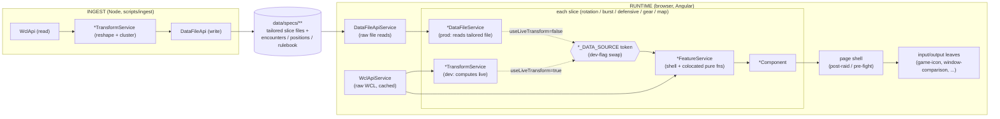

# warcraft-learner

A web-based diagnostic tool for Mythic WoW raiders: it evaluates Warcraft Logs combat data against AI-generated, spec-specific rulebooks and delivers coaching-style feedback benchmarked against top parses. The app is a **fully static Angular SPA** on GitHub Pages - no backend, all analysis client-side, WCL queried directly from the browser with an OAuth2 client-credentials token (no user login).

## Browser auth model (intentional embedded secret)

The browser authenticates to WCL with the **client-credentials** grant against `/api/v2/client`, using a client id + secret **hardcoded in `core/services/wcl-auth.ts`** (and therefore shipped, public, in the static JS bundle). This is a deliberate trade-off, not a leak to fix:

- The token only reads the same **public** WCL report data the app always read; there is no private data behind it and no user-specific budget to lose. The app never required user-scoped access.
- The **only** risk is someone extracting the secret and draining the app's shared hourly rate-limit budget. Mitigation is manual: regenerate the secret at `warcraftlogs.com/api/clients/` and redeploy. WCL exposes **no API to rotate a client secret**, so this cannot be automated.
- There is **no login UI, callback route, or PKCE flow** anymore. `WclAuthService.getToken()` fetches and caches the token silently. Consequently the `userData.currentUser` "your own characters" convenience was removed end-to-end (a client token has no current user); users always supply a report code or character name.
- This is independent of the **ingestion** client credentials (`WCL_CLIENT_ID`/`WCL_CLIENT_SECRET`), which remain server-side-only GHA secrets used by the CLI - see below.

## Branding & naming

- **The product name is always `warcraft-learner`** - lowercase, hyphenated, exactly that casing. Never "Warcraft Learner", "WarcraftLearner", or any other variant. This applies to the page `<title>`, nav wordmark, CLI banners, READMEs, and any new user-facing copy.
- **Do not confuse it with "Warcraft Logs"** (a.k.a. WCL) - that is the external data provider, a separate product. Leave "Warcraft Logs" / "WCL" strings as-is; only our own app name is normalized to `warcraft-learner`.
- **Logo / favicon** - gold shield with an ascending bar chart. Single source of truth: `frontend/public/favicon.svg`, which drives the `.ico` (regenerated at 16/32/48px via `sharp` + `png-to-ico`, never hand-edited) and the nav-bar mark. `index.html` references the SVG first (`type="image/svg+xml"`) with the `.ico` as legacy fallback. The nav-bar logo (`shared/components/page-nav`) is the same artwork inlined as SVG so it themes with CSS vars - set its fills via Tailwind classes (`fill-[var(--gold)]` / `fill-[var(--surface)]`), **not** `fill="var(--…)"` attributes (browsers don't reliably honor them). Brand gold `--gold` (`#e5cc80`) is the WCL 100-parse "Astounding" gold; the favicon's literal hex must track the `styles.scss` tokens.

## Analysis design principles

- **All findings are bench-driven; always assume complete ingested data.** Every analysis finding derives from the top-parse bench data for the specific encounter+spec. Do not add fallbacks, null guards, or special-case code for missing bench data - if data is absent that is an ingestion problem, not an analysis problem. This applies to lost-cast detection, held-past-reset, opener delay, and any future findings.

## Writing style

- **Never use em-dashes (U+2014) or en-dashes (U+2013)** anywhere - not in docs, code comments, commit messages, UI copy, or generated output. Also avoid the Unicode minus (U+2212). Use a plain ASCII hyphen (`-`) for ranges and parenthetical asides, or rephrase. This applies to every file in the repo and any text the tooling emits.

## Frontend conventions

These are hard rules for all Angular code. The `angular-developer` skill (`.claude/skills/angular-developer`) captures the broader Angular/TypeScript best practices - use it when building or refactoring components.

- **Styling: Angular Material components + minimal TailwindCSS utilities only.** Component styling is pure Tailwind utilities with no per-component style files (no `styleUrl`, no inline `styles:` arrays). The project has exactly one stylesheet and zero `.css` files: a single global `frontend/src/styles.scss` that holds the Angular Material `mat.theme()` mixin (no plain-CSS equivalent), the design tokens, the `.mat-mdc-*` DOM overrides, and the `badge-*` classes. Angular compiles it through its built-in Sass support. Components should have no `styleUrl`/`styles` unless there is no other option. Use Material building blocks (`mat-card`, `mat-chip-set`/`mat-chip`, `mat-divider`, `mat-icon`, `mat-button`, ...) for structure, and Tailwind utility classes for layout/spacing. Theme colors come from the CSS custom properties in `styles.scss` via arbitrary values, e.g. `text-[var(--muted)]`, `border-[var(--border)]`. Status glyphs reuse the global `badge-success` / `badge-warning` / `badge-info` / `badge-critical` classes on a `mat-icon`. Look at `pages/post-raid/post-raid.html` and `shared/components/window-comparison` for the reference style.
- **No hardcoded colors anywhere - ever.** Never write a hex (`#3fb950`), `rgb()`/`rgba()`, or named CSS color in a component TS file, template, or constant. There is exactly one source of color truth: the design tokens in `styles.scss` (`--success`, `--warning`, `--critical`, `--info`, `--muted`, `--border`, `--surface`, `--bg`, `--gold`, `--accent`, `--text`). Use them via Tailwind arbitrary values (`text-[var(--success)]`, `bg-[var(--critical)]/55`, `border-[var(--border)]`) or the global `badge-*` classes. Do **not** declare local `const COLOR_GOOD = '#3fb950'` maps or `Record<Status, string>` hex/rgba lookups - they duplicate tokens that already exist. Canvas / imperative-draw components (`range-chart`, `positioning-map`) that genuinely cannot consume `var(--token)` read the tokens at draw time via `getComputedStyle(...).getPropertyValue('--x')` - and carry **no hardcoded hex/rgba, not even as a fallback** (see the `token()` helper in `range-chart.ts`).
- **Component TS never produces CSS classes or style strings; the template owns all styling.** A `computed()`/field must **never** return a CSS class name, a `badge-*`/`text-[var(--…)]` string, or a `Record<Status, classString>` map. It exposes **semantic state only** - a status enum (`'success' | 'warning' | 'critical' | 'muted'`), a raw number, or a boolean. The **template** maps that state to classes with a bracket-free `[class.badge-success]="status() === 'success'"` binding (or `@if`/`@switch`). Note `[class.x]` cannot toggle a Tailwind arbitrary-value class (`bg-[var(--success)]/55`) because of the brackets; when a status needs a token-driven multi-property look, add a **semantic class to `styles.scss`** (the `badge-*` / `fill-*` / `seg-*` family) and toggle it by name - the class definition lives in the one stylesheet, the *choice* lives in the template, and the component only emits the enum. `shared/components/compact-ability-row` and `shared/components/window-comparison` are the reference examples. **Static, non-conditional `host: { class: '…' }` strings are allowed** (idiomatic Angular host styling, e.g. `page-nav`, `callout`) but must contain no hardcoded colors and no conditional logic.
- **Never build inline `style` strings in component TS.** No `computed()` returning `` `left:${x}%;background:${c};border:1px solid ${c}` ``, and no `[style]="someStringExpr"` in templates. For genuinely dynamic numeric geometry (a percentage width, a computed `left`), expose the **raw number** from the `computed()` and bind a single CSS property: `[style.width.%]="widthPct()"`, `[style.left]="leftValue()"`. Everything else (colors, borders, opacity, sizing) is a Tailwind class. Tailwind v4 supports opacity on token colors via `bg-[var(--success)]/55`.
- **Layout/structure lives in the template, not in TS.** Never compute Tailwind layout class strings in a `computed()` (e.g. `gridCols = computed(() => 'grid-cols-[1fr_6rem_6rem]')`). Express conditional column counts with `@if` around the cells and fixed-width utilities (`flex-1`, `w-20`, `w-24`) directly in the template. When a child row and a parent header must align, mirror the **same literal widths** in both templates and add a comment on each pointing at the other - do not centralize them through a TS string.
- **Use an external `templateUrl` file for any component beyond a trivial handful of elements.** Inline `template:` strings are only for tiny (roughly <10-line) markup. A table row, a card, or anything with multiple `@if`/`@for` branches gets its own `.html` file next to the `.ts` (CLAUDE's inline-template note is for genuinely small components; readability wins for anything larger).
- **All formatting goes through Angular pipes**, never ad-hoc string building in component TS. Durations -> `FormatDurationPipe` (`formatDuration`), compact damage -> `FormatDamagePipe` (`formatDamage`), decimals -> the built-in `DecimalPipe` (`number`), spec names -> `FormatSpecPipe`. View-model `computed()`s should expose **raw numeric values**; the template formats them. Add a new shared pipe under `shared/pipes/` rather than formatting inline.
- Time windows are rendered as a `m:ss - m:ss` range (start to end), matching the live/post pages.
- **Spells and items render through the shared `wl-game-icon` component** (`shared/components/game-icon`), never ad-hoc text or ``. It is an **inputs-only leaf with three required inputs** - `[id]`, `[icon]`, `[name]` are all `input.required` and every call site passes all three resolved values directly (no `!`, no `?? ''`, no optional `icon?`). The component normalizes a trailing image extension before building the zamimg URL, so a baked `.jpg` icon is fine; an empty `icon=""` legitimately renders name-only (no art). Feature services resolve icon + name from the ingest-baked `ability_icons` map (complete by construction - see the analysis-design note on complete ingested data) and/or the report's `masterData.abilities`; there is **no runtime fallback** for a missing entry (an absent icon/name is an ingestion problem). There is no global icon cache. On `/pre` the icons come straight from the baked `ability_icons`, so spells render with art there too.
- **`wl-game-icon` already renders both the icon and the name** (as a Wowhead link). Never place a separate `{{ label }}`/name `<span>` next to a `wl-game-icon` for the same spell/item - that double-prints the name. Render `<wl-game-icon [id]="id" [icon]="row.icon" [name]="row.name">` (inside an `@if (row.spellId; as id)` narrowing branch) alone; use a plain `<span>` label **only** as the `@else` fallback when there is no `spellId`/`id` to give the icon component.

### API service conventions

- **`get*` verb for all network methods.** Never `fetch*`, noun-first (e.g. `charLookup`), or other inconsistent prefixes. Examples: `getReport`, `getUserCharacters`, `getCharacter`, `getCharGear`.
- **GraphQL query strings live in `core/services/wcl-queries.ts` only.** Never inline a query string inside a method. Each query must have a companion `*Vars` interface (e.g. `ReportQueryVars { code: string }`). Never use `Record<string, unknown>` as the variables type - use the typed interface.
- **Response-to-model mapping lives in the consuming slice/shell, not the transport.** `wcl-api.ts` is pass-through: it calls `query(...)` and returns the raw WCL shape (typed in `core/models/wcl.models.ts`). Each slice/shell colocates the small pure projection it needs (e.g. `toParseRankings`, `extractGear`, `specOf`). There is no runtime `wcl-mappers.ts`.
- **No silent error swallowing.** Any `catch` on a best-effort operation must call `logWarn(context, err)` from `core/log.ts` before discarding the error. This applies to `.catch(() => {})`, empty `catch {}` blocks, and any fallback that silently substitutes a default. The best-effort fallback itself is fine (e.g. returning `[]`); the silence is not.
- **No single-letter identifiers for non-trivial values.** `d`, `fd`, `p`, `r`, `e` as local variable names are banned where the value has semantic content. Name by content: `result`, `fightsData`, `enchantData`, `queryParams`, `reportParam`. Short lambda params (`f`, `c`) in obvious inline callbacks (e.g. `.find(f => f.id === id)`) are acceptable.

### Polling and async state conventions

- **Live-sync / polling orchestration belongs in a service, not a component.** Timer and visibility machinery lives in `LiveReportSyncService` (see `core/services/live-report-sync.ts`). Components wire up polling declaratively: `combineLatest + switchMap + exhaustMap + takeUntilDestroyed`. No manual `Subscription` field or `_pollSub?.unsubscribe()` juggling in components.
- **No imperative subscription management alongside `takeUntilDestroyed`.** Pick one teardown strategy: either a stored `Subscription` unsubscribed in `ngOnDestroy`, or `takeUntilDestroyed(destroyRef)` in an RxJS chain. Do not mix both in the same pipeline.

### Angular/TypeScript conventions

These are the general Angular/TypeScript best practices for the app. The mechanizable ones are **enforced by ESLint** (`frontend/eslint.config.js`, run via `npm run lint` - see "Linting" below): no `any` (use `unknown`); native control flow (`@if`/`@for`/`@switch`) over `*ngIf`/`*ngFor`; standalone components with no explicit `standalone: true`; host bindings in the `host` object, never `@HostBinding`/`@HostListener`; `inject()` over constructor injection; and the `wl` component/directive selector prefix. The remaining guidance is **not lintable** but still expected:

- **Accessibility is a hard requirement.** Markup must pass AXE checks and meet WCAG AA minimums - focus management, color contrast, and ARIA attributes. Interactive elements must be focusable (a `role`/`(keydown)` handler needs a `tabindex`).
- **Keep components small and focused** on a single responsibility; keep services around a single responsibility with `providedIn: 'root'` for singletons.
- **Prefer type inference** when the type is obvious; use strict type checking.
- **Signals for state**: `signal()` for local state, `computed()` for derived state, `set`/`update` never `mutate`. Keep state transformations pure and predictable.
- **`input()`/`output()` functions** over the `@Input`/`@Output` decorators. Reactive forms over template-driven. `class`/`style` bindings over `ngClass`/`ngStyle` (the styling rules above already require this).
- **`NgOptimizedImage` for static images** (it does not work for inline base64). Templates stay simple - push complex logic into the component.
- Prefer inline `template:` only for genuinely tiny components; anything larger gets an external `templateUrl` (see the inline-template rule above). External templates/styles use paths relative to the component TS file.

## URL routing

Selection is **not** persisted in the URL and pages do **not** auto-run from query params. This is a
deliberate anti-abuse measure: because the browser holds the WCL client-credentials secret and shares one
account-level rate-limit budget with ingestion, a crawler following a shared `?report=...` deep-link used
to auto-run a full (expensive) analysis on load and drain that budget. Removing URL-driven loading closes
that vector. Sticky state lives in localStorage instead (`core/services/selection-store.ts`): the
post-raid player **name** and the pre-fight **spec**. Everything else is re-entered.

### Player page (`/`)
A report is loaded only by an explicit **Analyze** action (or Enter) on a **validated** report reference -
a full WCL report URL or a bare 16-character report code (`isValidReportCode` in `post-raid.vm.ts`). The
Analyze button stays disabled, and **no** WCL request fires, until the input is a valid code. There is no
report/fight/player query param and nothing auto-loads on page open. The sticky player name re-selects the
same character once a log loads.

### Pre-fight page (`/pre`)
Spec + encounter selector; all data is static (ingested bench data), no character or log required. There
is no `spec`/`encounter` query param. The last spec is restored from localStorage; the encounter is
re-selected each visit.

## Architecture

```
warcraft-learner/
├── frontend/                   # The entire application - Angular 22
│   ├── src/app/
│   │   ├── pages/
│   │   │   ├── post-raid/      # Main player analyzer (/)
│   │   │   ├── pre-fight/      # Pre-fight gear check (/pre)
│   │   │   └── live/           # Live analysis - polls for new pulls (/live)
│   │   └── core/
│   │       ├── services/                  # The two runtime API services + plumbing
│   │       │   ├── wcl-api.ts             # WCL transport (raw events/report/rankings, cached, pass-through)
│   │       │   ├── data-file-api.ts       # Pass-through reader of data/specs/** (incl. getSlice)
│   │       │   ├── live-report-sync.ts    # Polling timer / visibility service
│   │       │   ├── wcl-queries.ts         # GraphQL strings + typed *Vars interfaces
│   │       │   └── wcl-auth.ts            # Client-credentials token (embedded secret)
│   │       ├── data-source/               # provide-data-source.ts (file/live DI swap)
│   │       └── models/                    # TypeScript interfaces
│   │   # Each card under pages/post-raid/{rotation,burst-windows,defensive,gear,map}/ is a
│   │   # self-contained slice: *-data-source.ts (token) + *-data-file.service.ts +
│   │   # *-transform.service.ts + *.service.ts (feature shell) + component. /pre reuses them.
│   ├── public/
│   │   └── data/specs/         # Static data files - served as assets
│   │       ├── index.json              # Spec manifest: [{spec, encounter_count}] (generated by ingestion)
│   │       └── {Spec}/
│   │           ├── rulebook.json       # AI-generated rulebook
│   │           ├── guides.json         # Guide list with scraped content
│   │           ├── encounters.json     # Index: [{id, name, sample_count}]
│   │           ├── {slice}/             # Per-slice tailored file: {burst,rotation,defensive,gear}/{enc_id}.json
│   │           └── positions/
│   │               └── {enc_id}.json  # Top-parse position timelines (map feature)
│   └── scripts/                # Node.js CLI tools (TypeScript, run via tsx; no server needed)
│       ├── ingest/                  # Ingestion orchestrator + discovery-only modules + colocated *.spec.ts tests
│       │   ├── orchestrator.ts      # Entry: boots Angular runtime, drives the 5 transform services, writes tailored files
│       │   ├── angular-runtime.ts   # Boots jsdom + Angular TestBed injector; provides Node transports; returns transform services + WclApiService + DataFileApiService
│       │   ├── node-wcl-transport.ts        # FetchWclTransport - plain fetch GraphQL, in-run cache
│       │   ├── node-data-file-transport.ts  # FsDataFileTransport - fs read/write/list
│       │   ├── code-hash.ts         # Hash of the transform source files (signature-skip)
│       │   ├── signature.ts         # source_signature compute/compare (signature-skip)
│       │   ├── wcl-fetchers.ts      # Discovery: getEncounters (worldData + rankings liveness probe)
│       │   ├── wcl-client.ts        # Discovery: WclQueryClient interface + EventFetchOptions + BudgetExceededError
│       │   ├── wcl-queries.ts       # Discovery: RATE_LIMIT_QUERY, ENCOUNTERS_QUERY, RANKINGS_QUERY (+ RankingsQueryVars)
│       │   ├── wcl-mappers.ts       # Discovery: SPEC_TO_WCL, mapRankings, filterEncounters, groupEncountersByZone, exclude patterns
│       │   └── models/              # wcl.models.ts: the ingest WCL shapes
│       ├── build-rulebook.ts   # Rulebook management (build prompt, save AI output)
│       └── scrape-guides.ts    # Re-scrape all guides (default); add one via --spec/--url
├── prompts/
│   └── rulebook_skill.md       # LLM prompt template for rulebook generation
├── .github/workflows/
│   ├── deploy-pages.yml         # Build Angular --base-href /warcraft-learner/ → GitHub Pages (push to main)
│   ├── ingest-parses.yml        # Hourly via an external cron-job.org workflow_dispatch trigger (GitHub's own schedule cron was too unreliable) + manual: runs `npm run scrape` then `npm run ingest`, commits data/specs/**
│   ├── pr-preview.yml           # Per-PR preview deploy
│   ├── pr-preview-cleanup.yml   # Tear down preview when PR closes
│   └── test.yml                 # CI: lint + tests
```

**Data location**: `frontend/public/data/specs/` - Angular's `public/` directory serves these at `/data/specs/` in both the dev server and the built app.

**Build output** (`static/angular/`) is gitignored - rebuilt by `deploy-pages.yml` on every push to `main`.

**Local dev / scripts** (all run from `frontend/`):

| Command | Description |
|---|---|
| `npm start` | Angular dev server on http://localhost:4200 |
| `npm run build` | Production build to `../static/angular/` |
| `npm run ingest` | Run the ingestion orchestrator (`scripts/ingest/orchestrator.ts`), which drives the Angular transform services headlessly (all rulebook specs by default, or `--spec Name` for one); needs `WCL_CLIENT_ID`/`WCL_CLIENT_SECRET` |
| `npm run scrape` | Re-scrape all existing guides (default); `--spec Name --url URL` to add and scrape one |
| `npm run rulebook` | Manage rulebooks (build AI prompt, save AI JSON output) |

The CLI scripts are TypeScript run via `tsx` (e.g. `tsx --tsconfig tsconfig.scripts.json scripts/ingest/orchestrator.ts`), not `.mjs`/`node`. `WCL_CLIENT_ID`/`WCL_CLIENT_SECRET` come from the [Warcraft Logs API clients](https://www.warcraftlogs.com/api/clients/) page and are only used server-side (GHA secrets), never in the browser. No Anthropic API key is needed - rulebook generation is a copy-prompt / paste-back flow that works with any LLM.

## Linting

ESLint enforces the Angular/TypeScript conventions. Flat config lives in `frontend/eslint.config.js` (typescript-eslint + angular-eslint, recommended + stylistic sets) and runs through the Angular CLI lint target (`src/**/*.ts` + `src/**/*.html`; the Node `scripts/**` are not linted).

```bash
npm run lint   # ng lint -> eslint over src/**
```

On top of the recommended sets the config pins the convention rules: `@typescript-eslint/no-explicit-any` (ban `any`), `@angular-eslint/prefer-standalone`, `@angular-eslint/prefer-host-metadata-property`, `@angular-eslint/prefer-inject`, and `@angular-eslint/template/prefer-control-flow`, plus the `wl` selector prefix. A few recommended rules carry deliberate option tweaks documented inline: template `eqeqeq` allows the `x != null` idiom, `no-unused-vars` allows the `_`-prefix convention, and `no-empty-function` allows empty private constructors (the static-factory guard).

## Testing

The goals are readability, speed, and trivial testability: a test reads like a statement of the business rule, runs in milliseconds, and needs no ceremony.

**Framework and how to run.** Tests use [Vitest](https://vitest.dev) via Angular's official `@angular/build:unit-test` builder (configured in `angular.json`). jsdom is the DOM environment and the builder initializes the `TestBed` environment itself. The app is zoneless (no zone.js); component tests opt into zoneless change detection per-`TestBed` through the `mountVm` harness, so there is no global setup file. The builder needs Node `>= 22.22.3` (the Angular CLI floor).

```bash
npm test            # ng test (Vitest) + scripts Vitest + scripts typecheck
npm run test:watch  # watch mode for the frontend suite
```

`npm test` runs three things in sequence:

1. `ng test` - the frontend specs under `src/**` (TestBed-backed; needs the Angular builder).
2. `vitest run --config vitest.scripts.config.ts` - the ingestion specs under `scripts/ingest/**`.
3. `tsc -p tsconfig.scripts.json --noEmit` - typechecks the Node scripts.

The `src/**` specs cannot run under a bare `npx vitest` - they need the `@angular/build:unit-test` builder to set up the Angular TestBed. Use `ng test` for those; the `scripts/**` specs are plain Node Vitest.

**Functional core, imperative shell (per slice).** There is no central analysis module. Each vertical slice (`pages/post-raid/{rotation,burst-windows,defensive,gear,map}/`) owns its math as named, pure, **total** functions colocated in its own `*.service.ts` / `*-transform.service.ts` - no Angular, no async, no IO. The service classes are thin imperative shells that fetch and call those pure functions. So every slice has two kinds of spec, colocated next to the code:

| Spec | What it covers |
|---|---|
| `*-transform.service.spec.ts` | the slice's bench math (clustering / aggregation) as pure fns, **plus** an end-to-end pass through the `*TransformService` with a fake `WclApiService` |
| `*.service.spec.ts` | the `*FeatureService`'s pure view-model fns (table-driven), **plus** an end-to-end pass with a fake `*_DATA_SOURCE` (and a fake `WclApiService` where the slice fetches the player log) |

Ingestion runs these very `*TransformService`s headlessly, so the only specs under `scripts/ingest/**` cover the discovery helpers it still owns (`wcl-fetchers.spec.ts`, `wcl-mappers.spec.ts`, `code-hash.spec.ts`, `signature.spec.ts`).

**Conventions: tests as documentation.** Colocate specs next to the unit (`burst.service.spec.ts` beside `burst.service.ts`). `describe` names the unit (`'burstWindowStatus'`); `it` is a behavior sentence with no "should" (`it('flags a value more than 2 sigma above the mean')`). For rule/threshold tests, pair every "triggers" case with a "does not trigger at the boundary" case - boundary comparisons are strict (a value exactly at `mean + 2*stddev` is **not** an outlier).

**Fluent builders (`src/testing/`).** WCL event data is massive and quirky, so never load a JSON blob - build a minimal, readable event stream:

```ts
import { Events } from 'src/testing/builders/events';
import { SHADOW_BLADES, BLOODLUST } from 'src/testing/spell-ids';

const casts = Events.cast(SHADOW_BLADES, '0:01').cast(SHADOW_BLADES, '3:05').build();
const buffs = Events.start().applyBuff(BLOODLUST, '0:15').build();
```

Times are `"m:ss"` strings; with `FIGHT_START = 0` they map straight onto the fight-relative milliseconds the slices see. Defaults: player is actor `1`, boss is `2`; `damageTaken(...)` reverses them; `positioned(x, y, deg)` takes plain yards/degrees and encodes the WCL wire units. The `bench(...)` and `rulebook(...)` fixtures default every field, so a test states only what it exercises:

```ts
import { bench } from 'src/testing/builders/bench';
import { rulebook } from 'src/testing/builders/rulebook';

const bk = bench({ perCd: { 'Shadow Blades': { avg_first_cast_s: 3, stddev_first_cast_s: 1 } } });
const rb = rulebook({ cooldowns: [{ name: 'Shadow Blades', spell_id: SHADOW_BLADES, cooldown: 180 }] });
```

**End-to-end through a service (fake client).** The live WCL path is unreachable from CI, so the transform/feature services are driven with a fake `WclApiService` (canned rankings + report + `Events`-built streams), exercising the whole slice pipeline in-process. For a `*FeatureService` that reads a `*_DATA_SOURCE`, provide a fake source alongside the fake `WclApiService`.

**Signal view-models in leaves (`mountVm`).** Read presentational leaves' `computed()` signals directly via the `mountVm` harness - no DOM assertions, no `detectChanges`:

```ts
import { mountVm } from 'src/testing/component-harness';

const { vm } = mountVm(WindowComparisonComponent, { windows: [/* ComparisonWindow[] */] });
expect((vm['overviewMax'] as () => number)()).toBe(300);
```

`mountVm` configures a zoneless `TestBed`, applies each `input.required` via `setInput`, and returns the instance; pass stub providers as the third argument for components that inject a service. Feature components are thin (they delegate to one `*FeatureService` in an `effect`), so their logic is covered by the service spec rather than by mounting the component.

## Architecture: layers & rules (vertical-slice target)

The app is built as **per-use-case vertical slices** (map / burst / rotation / defensive / gear). Each slice is independent and follows the same shape; the **Burst** slice (`pages/post-raid/burst-windows/`) is the reference implementation. All new work must follow these layer rules.

The data path is two symmetric pipelines that meet at the static data files:

```
INGEST (Node)                                        RUNTIME (browser)
WclApi (read, pass-through)                          WclApiService (read, pass-through, cached)
   -> *TransformService (the only transform)            DataFileApiService (read, pass-through)
   -> DataFileApi (write)  ->  data/specs/**  ->         -> *DataSource (DI token, dev-flag swap)
                                                         -> *FeatureService (runtime shell)
                                                         -> *Component -> page shell -> leaves
```



Reading the runtime graph: in production each slice's `*_DATA_SOURCE` resolves to its `*DataFileService` (reads the ingest-baked tailored file); under the `useLiveTransform` dev flag it resolves to the `*TransformService`, which recomputes the same bench live from WCL (no ingestion). Either way the `*FeatureService` reads that bench plus the player's own log (cached `WclApiService`) and produces the view-model; the page shell only resolves selection and composes cards.

**Layer rules (hard):**

- **Pass-through API services - exactly two at runtime.** `WclApiService` (raw WCL events/report/rankings/combatant-info/player-details) and `DataFileApiService` (raw static-file reads). They do **no** remapping or aggregation: bytes in, typed bytes out. Every response projection (rankings -> `ParseRanking`, combatant info -> `CharacterGear`, player details -> spec) is a small pure function colocated in the consuming slice/shell, not in the transport. There is no `wcl-mappers.ts` on the runtime side.
- **Self-contained services - import ONLY the two API services (or the slice `*DataSource` token) + models + `logWarn`.** Both the `*TransformService` and the `*FeatureService` follow this: no importing of outside analysis, mappers, or UI components. Each **reimplements/owns** its math as named, pure, **total** functions (returns `0`/`null`/`[]` for empty input, never throws; optional findings return `T | null`), **exported from and colocated in that service's own `*.service.ts`**, with no Angular/`inject()`/IO. Self-containment over sharing: the transform owns its own math and pulls nothing from outside analysis or mappers (ingestion runs this very service, so there is no second implementation to keep aligned). Data shapes a service needs (view-model rows like `ComparisonWindow`/`RangeRow`, ranking rows like `ParseRanking`) live in `core/models`, never in a component or mapper file. Tested directly in `*.service.spec.ts`. Cross-slice **presentational** derivations may still live under `shared/` (e.g. `shared/gear/gear-comparison.ts`). (No separate `*.vm.ts` file; the older `pre-fight.vm.ts` / `post-raid.vm.ts` are legacy and may stay.) One carve-out: importing generic statistics primitives from `d3-array` (`mean`/`median`/`deviation`/`quantile`) directly is permitted, the same way `Math` is - they are pure arithmetic, not domain analysis. Call them directly at the use site (guard d3's `undefined`-on-empty return with `?? 0` to preserve the total-function contract); each service keeps its own tiny `round` helper since `d3-array` has no rounding function. There is no shared stats wrapper module.
- **`*TransformService` - one per use case, self-contained.** Reimplements its own derivation (its colocated pure functions) to build a slice's prepared data from the two API services - it does NOT import the ingest analysis. Selectable at runtime under the dev flag to compute the prepared data live (no ingestion). Ingestion runs this **very same** `*TransformService` headlessly (booted through the Angular injector in `scripts/ingest/orchestrator.ts`) to write the slice's tailored file (`data/specs/{spec}/burst/{enc}.json`, denormalized + ready to render); ingest and the dev-flag live mode are the same implementation, not just the same shape.
- **`*DataSource` interface + `*_DATA_SOURCE` InjectionToken - the swap point.** Two impls per slice: `*DataFileService` (reads the tailored file - production) and `*TransformService` (computes live - no-ingestion dev). The provider helper `core/data-source/provide-data-source.ts` binds one impl per `environment.useLiveTransform`. This is the ONLY place the data source differs.
- **`*FeatureService` - the runtime shell, one per feature component.** Injects its `*DataSource` token + the cached `WclApiService` (the player's chosen log), calls the pure transform functions colocated in its `*.service.ts`, and exposes signals. It contains **no arithmetic** and no other domain service.
- **Feature components - inject exactly one service: their `*FeatureService`.** No reaching sideways into `PositioningPanelService`, `IconCacheService`, etc. Spell/item art is the ingest-baked `icon`+`name` passed as inputs to `wl-game-icon`. Cross-feature actions (e.g. "open map") are an `output()` the page wires.
- **Page shells - zero domain services.** They read `report`/`fight`/`player` from the route and compose feature components, passing selection as inputs. Framework tokens (`ActivatedRoute`, `Router`) do not count.
- **Presentational leaves - inputs/outputs only.** `game-icon`, `compact-ability-row`, `window-comparison`, `range-chart`, `callout`, `loading-spinner`. No services beyond framework tokens.

**Migration status:** the post-raid and pre-fight pages are fully converted - every card (rotation / burst / defensive / gear / map) is a self-contained slice, and the legacy runtime pipeline (`AnalysisService`/`AnalysisEngineService`, the analysis Web Worker, `core/analysis/*`, `MapContextService`, the global `PositioningPanelService`, `EncounterService`) has been **deleted**. `DataFileApiService` is the single static-file reader. The generic `encounters/{enc}.json` bench file and `DataFileApiService.getBench` are gone: each per-slice `*TransformService` computes its tailored file directly from WCL, and ingestion runs those same services to write them (no generic bench is reshaped). `IconCacheService` and the runtime `wcl-mappers.ts` have both been removed: `wl-game-icon` is inputs-only, and each slice/shell owns the small WCL-response projection it needs (the ingest side keeps only a slim discovery `scripts/ingest/wcl-mappers.ts` for rankings/encounter filtering).

## Key flows

### Player analysis (client-side, per-slice feature services)

The legacy monolith (`AnalysisService`/`AnalysisEngineService`, the `computeAnalysis()` Web Worker, and the `core/analysis/*` modules) has been **removed**. Each card is now a self-contained vertical slice (see "Architecture: layers & rules"); the post-raid page (`post-raid.ts`) is a shell that resolves selection and composes the feature cards.

1. The shell accepts a WCL report code + fight ID + player actor ID, fetches the report, and resolves spec from `playerDetails` (the reliable source since the Midnight `actor.subType` change - see WCL API quirks). It passes `spec`/`encounterId`/`report`/`fight`/`player` as inputs to each feature card; it does no domain analysis itself.
2. Each `*FeatureService` reads its prepared bench via its `*DataSource` (the tailored file in prod, or the live `*TransformService` under `useLiveTransform`) and fetches the player's own log (`Casts`/`Buffs`/`DamageDone`/`DamageTaken`) via the cached `WclApiService`, then computes its slice with its colocated pure functions:
   - **Rotation** (`rotation.service.ts`) - per offensive cooldown: lost casts (`expected = 1 + floor(fight_duration / cd_cooldown)`), bloodlust alignment (>2σ), first-cast delay (>2σ), held-past-reset (>2σ above `avg_gap_s`, skipped when null), hold suggestions (≥40% of top parsers delay >8s), cast efficiency (downtime vs p90), and success. Plus the **rule engine** (`cast_without_prior`, `hold_cooldown_for_anchor`) and the per-cooldown comparison table. Findings split into **Needs Improvement** / **Timing Suggestions** / **Doing Well**.
   - **Defensive** (`defensive.service.ts`) - lost/held/hold-suggestion findings per defensive plus buff-window-centric **Defensive Windows** (apply→remove, damage taken vs top parses).
   - **Burst** (`burst.service.ts`) - **Burst Windows**: top recurring CD-cast-centric damage windows, with the player's window damage computed from their own log.
   - **Gear** (`gear.service.ts`) - the player's combatant-info gear (talents/trinkets/enchants) vs the bench; bench-only on `/pre`.
   - **Map** (`map.service.ts`) - `MapFeatureService` owns the positioning panel state (replacing the old global `PositioningPanelService`); other cards emit an `openMap` output the page forwards to it.
3. Ability art is resolved from the report's `masterData.abilities` (and seeded into the small `IconCacheService` for the shared `wl-finding-table`), since WCL removed `gameData.spell()`.

### Ingestion (`npm run ingest`)
Runs `frontend/scripts/ingest/orchestrator.ts`, which boots a headless Angular runtime (`scripts/ingest/angular-runtime.ts`: jsdom + Angular TestBed injector wired to the Node WCL + data-file transports) and drives the SAME five `*TransformService`s the browser uses, persisting through the SAME `DataFileApiService` (Node filesystem transport). There is no separate Node analysis pipeline. Also runs as the `ingest-parses.yml` GHA hourly (cron `23 * * * *`) and on manual `workflow_dispatch`. The same hourly workflow runs `npm run scrape` first to keep guide content fresh, then ingestion.

1. Boots the Angular runtime and authenticates to WCL with client credentials (from `WCL_CLIENT_ID`/`WCL_CLIENT_SECRET` environment variables - server-side secret, only used in GHA, never in the browser).
2. Discovers the specs that have a `rulebook.json` and the current live encounters (`getEncounters`: `worldData` discovery + a cheap rankings liveness probe).
3. Per encounter: asserts remaining WCL budget, fetches rankings (cheap), computes a code+ranking `source_signature` (an analogue of the old INGEST_HASH, hashing the transform source files + the parse set), and **skips** the encounter when the signature matches the stored stamp.
4. Otherwise runs the five transform services (`burst`/`rotation`/`defensive`/`gear`/`map`) under bounded concurrency. Each fetches the parses it needs (`Casts`/`Buffs`/`DamageDone`/`DamageTaken`, plus `includeResources`/`hostilityType` events for positions) via the shared cached `WclApiService` and computes its slice.
5. Writes the stamped per-slice tailored files (`{spec}/{burst,rotation,defensive,gear}/{enc_id}.json`) and per-parse position timelines (`positions/{enc_id}.json`).
6. Rebuilds the `{spec}/encounters.json` and top-level `index.json` indexes, then prunes stale encounters.

GHA commits `frontend/public/data/specs/**`, which triggers `deploy-pages.yml` to rebuild and redeploy.

**Ingesting spec data from a branch (preferred over local ingestion - no local WCL credentials needed).** The ingest workflow can run on any branch via manual trigger:

1. Push the branch to GitHub (rulebook changes, new spec dirs, etc.).
2. **Actions -> Ingest Parse Samples -> Run workflow**, select the branch.
3. Optionally set a specific spec name, or leave blank to ingest all specs that have a `rulebook.json`.
4. Run. The workflow commits updated `frontend/public/data/specs/**` directly to that branch; `git pull` to get the files.

For Claude: trigger via the `mcp__github__actions_run_trigger` tool on the current feature branch, wait for the run to complete, then `git pull`.

> **Keep data shapes in sync.** Because ingestion runs the very same `*TransformService`s the browser uses, the tailored slice shapes are defined in exactly one place - each slice's `*Bench` interface (its `*-data-source.ts`) plus the relevant `core/models/*` - and ingestion writes precisely those, so the slice shapes stay in sync automatically. Changing a slice's `*Bench`/model therefore updates runtime and ingest at once (one implementation). You still keep the rulebook skill + schema in sync (`prompts/rulebook_skill.md`, `prompts/rulebook.schema.json`) since the transforms consume the rulebook (`duration`, `spell_id`s), and the indexes (`index.json`, `{spec}/encounters.json`) and `positions/{enc}.json` documented in the **Data models** section below. Already-committed JSON under `data/specs/**` keeps stale fields until the next re-ingest - harmless, since consumers ignore unknown fields.

### Rulebook management (`npm run rulebook` / `npm run scrape`)
No web UI for rulebook management. Everything is CLI.

1. **Add + scrape guides** - `npm run scrape` re-scrapes every existing guide across all specs (web/YouTube/SimC APL), refreshing `guides.json`; this is what the hourly ingest workflow runs. To add a new guide, `npm run scrape -- --spec Name --url URL [--type web|youtube|simc]` appends and scrapes it.
   - **YouTube transcripts go through the Supadata API.** YouTube now gates caption/transcript data behind an authenticated, bot-checked session, so anonymous fetching (youtubei.js, yt-dlp) is refused from any IP. `scrapeYouTube` calls the [Supadata](https://supadata.ai) transcript API instead; set `SUPADATA_API_KEY` (env var locally, GHA secret for the hourly run). Transcripts are immutable, so the bulk refresh skips already-scraped YouTube guides - the metered API is only hit once per new/errored video. Without the key, YouTube guides record a non-fatal error; web/SimC are unaffected.
2. **Build AI prompt** - `npm run rulebook` → "Copy prompt": assembles `prompts/rulebook_skill.md` + all scraped guide content into a clipboard-ready prompt.
3. **Save rulebook** - paste AI output → `npm run rulebook` → "Save rulebook": writes to `rulebook.json`. No validation server needed - the CLI validates schema directly.

### Pre-fight gear check (`/pre`)
Entirely client-side. No backend calls.

1. User enters a character name/server/region (or WCL character URL).
2. `wcl-api.ts` queries `characterData.character.encounterRankings(includeCombatantInfo: true)` directly on WCL for the selected encounter - extracts gear, talents from the player's most recent ranked kill.
3. Bench data (talent distributions, trinket usage, enchant usage) loaded from the static per-slice gear tailored file `/data/specs/{spec}/gear/{enc_id}.json`.
4. A unified gear card rendered client-side (shared `wl-gear-section` in bench-only mode):
   - **Talents** - compares player's `v2:` talent fingerprint against top-parse distribution.
   - **Trinkets** - per-slot (12 = Trinket 1, 13 = Trinket 2) comparison.
   - **Enchants** - per-slot; missing enchants on high-consensus slots (>=70% of top parsers) flagged as warnings.

### Encounter selection
Encounters loaded from `/data/specs/{spec}/encounters.json` (static file). Filtered client-side to:
- Current expansion only (first unique expansion name in WCL API response - WCL returns newest first).
- Excludes zones matching: `beta`, `ptr`, `mythic+`, `complete raids`, `delves`, `torghast`.

## Data models

### `index.json` (`frontend/public/data/specs/index.json`)
Spec manifest rebuilt by the orchestrator (`scripts/ingest/orchestrator.ts` `rebuildSpecIndex`) by scanning each spec's `encounters.json` on disk - safe to run sharded (one spec at a time). Consumed by `DataFileApiService.getSpecs()` to populate the spec dropdown on `/pre`.

| field | notes |
|---|---|
| spec | WCL spec folder name, e.g. `SubtletyRogue` |
| encounter_count | Number of encounters with `sample_count > 0` |

### `guides.json` (`frontend/public/data/specs/{spec}/guides.json`)
| field | notes |
|---|---|
| id | Auto-incrementing integer |
| spec | WCL spec name, e.g. `SubtletyRogue` |
| url | Source URL |
| guide_type | `web`, `youtube`, or `simc` |
| content | Scraped text (up to 60k chars) |
| status | `pending` → `scraped` → `error` |

### `rulebook.json` (`frontend/public/data/specs/{spec}/rulebook.json`)
AI-generated rulebook. Extra top-level fields added on save: `guide_count`, `saved_at`.

### `positions/{enc_id}.json`
Per-parse position timelines for the positioning map (written by `MapTransformService.getMapData` run headlessly by `scripts/ingest/orchestrator.ts`; consumed by `core/services/positioning-core.ts` + `core/models/positioning.models.ts`). Top-level: `{spec, encounter_id, encounter_name, interval_s, sample_count, parses[]}`. Each parse: `{report_code, fight_id, player_name, duration_s, interval_s, player: PosRow[], enemies: [{game_id, name, is_boss, samples: PosRow[]}]}`. A `PosRow` is `[t_s, x, y, facing|null, mapID|null]` with **raw** WCL units (x/y in hundredths of a yard, facing in milliradians) - the frontend scales them. Enemies are keyed by `game_id` so the same boss/add matches across parses; `is_boss` = the enemy with the highest `maxHitPoints`.

### Raw parse samples (no longer persisted)
Raw per-parse samples are no longer written to disk (the old `parse_samples/{enc_id}.json` file is gone). The transform services compute each slice directly from WCL in-memory during ingestion, so there is no intermediate sample file.

### Rulebook JSON schema

All spell IDs **must** come from the rulebook - never hardcode spec-specific IDs.

```json
{
  "spec": "SubtletyRogue",
  "major_cooldowns": [
    {
      "name": "Shadow Blades",
      "spell_id": 121471,
      "cooldown": 90,
      "duration": 20,
      "align_with_bloodlust": true,
      "opener_priority": 1,
      "usage_rule": "..."
    }
  ],
  "defensives": [
    {
      "name": "Cloak of Shadows",
      "spell_id": 31224,
      "cooldown": 120,
      "duration": 5,
      "usage_rule": "..."
    }
  ],
  "rules": [
    {
      "type": "cooldown_pairing|cd_hold|opener|rotation|positioning|aoe_switch",
      "priority": "critical|high|medium|low",
      "description": "Rule title shown in the UI",
      "condition": null,
      "action": "Prescriptive coaching text shown as remedy"
    }
  ],
  "source_summary": "..."
}
```

### Rule condition schema

**`cast_without_prior`** - spell cast without a required companion within a time window:
```json
{
  "kind": "cast_without_prior",
  "spell_id": 185313, "spell_name": "Shadow Dance",
  "required_spell_id": 280719, "required_spell_name": "Secret Technique",
  "window_s": 5,
  "exception": { "context_spell_id": 121471, "context_window_s": 25, "position": "before" }
}
```

**`hold_cooldown_for_anchor`** - spell(s) used within hold window before an anchor spell:
```json
{
  "kind": "hold_cooldown_for_anchor",
  "spell_ids": [185313, 280719], "spell_names": ["Shadow Dance", "Secret Technique"],
  "anchor_spell_id": 121471, "anchor_spell_name": "Shadow Blades",
  "hold_window_s": 15
}
```

Rules without a `condition` (or `null`) are silently skipped.

## WCL API quirks

Non-obvious things that have caused bugs - read before touching gear extraction or spec resolution.

| Quirk | Detail |
|---|---|
| **`actor.subType` changed in Midnight** | Now returns class-only (`Rogue`). Use `playerDetails(fightIDs:[...])` to get full spec info. `WclApiService.getPlayerDetails` (via `buildSpecMap`) handles the conversion; the post-raid shell resolves spec from it. |
| **Gear array is positionally indexed** | WCL returns gear as a bare array; the array index (0-based) IS the slot number. No `slot` field. |
| **Weapon slots shifted in Midnight** | Gear array has 17 entries (0-16). Weapons at index 15 (MH) and 16 (OH). Index 14 is Back/Cloak. |
| **Trinket slots are 12 and 13** | Confirmed from `encounterRankings` responses. |
| **`permanentEnchant` is a string** | Numeric ID returned as string. `permanentEnchantName` is never populated. Enchant names resolved via `gameData.enchant(id)` in the gear transform service. |
| **Two incompatible talent formats** | `characterRankings` → old format (`{talentID, points}` list) → `v1:` key. `encounterRankings` → Midnight format (nested `nodeId` dict) → `v2:` key. ID spaces are incompatible; cannot compare directly. |
| **Solving the talent format problem** | The gear/rotation transform services fire a parallel `encounterRankings` query per ranked player to get the `v2:` talent key, overwriting the `v1:` key from `characterRankings`. |
| **`server.region` may be a string** | In `characterRankings` JSON blob, `server.region` is sometimes `"EU"` (string) rather than `{slug: "eu"}`. Handle both forms. |
| **`gameData.spell()` was removed** | Spell icons and names must come from `masterData.abilities` in the report response. |
| **Event positions need `includeResources: true`** | The default `events` response carries no coordinates. Passing `includeResources: true` attaches the actor's resource snapshot, which includes position. Adds bandwidth, so it is off by default and only requested by the positioning feature. |
| **Position is flattened onto the event, not nested** | With resources on, `x`, `y`, `facing`, `mapID` (plus `hitPoints`, etc.) appear at the **top level** of the event - there is no `sourceResources`/`targetResources` object. Each event describes **one** actor; `resourceActor` says which (`1` = source, `2` = target). Attribute the coords to `resourceActor === 2 ? targetID : sourceID`. |
| **Events default to friendly only** | The `events` query defaults to `hostilityType: Friendlies`, so an all-source `Casts` fetch returns only the raid. Boss/add casts (and their positions) require a separate fetch with `hostilityType: Enemies`. |
| **Position/facing units** | `x`/`y` are in hundredths of a yard (`÷100` → yards). `facing` is in milliradians (`÷1000` → radians) and its zero-point does not match a screen "up" axis - apply a `-π/2` offset so "behind the boss" renders behind (see `FACING_OFFSET_RAD` in `positioning-core.ts`). |
| **`mapID` marks the phase/sub-map** | Coordinates are only comparable between actors sharing a `mapID`; it changes across phases that swap maps. Filter to a common `mapID` before computing relative positions. |

## External APIs

| API | Auth | Where used |
|---|---|---|
| Warcraft Logs v2 (GraphQL, `/api/v2/client`) | Client credentials (browser; embedded secret, see "Browser auth model") | Report events, character rankings, gear lookup |
| Warcraft Logs v2 (GraphQL, `/api/v2/client`) | Client credentials (CLI/GHA only, never browser) | The transform services fetching parses (via the shared `WclApiService` under the Node transport, driven by `scripts/ingest/orchestrator.ts`) |

## Analysis thresholds

| Threshold | Derived from | Condition |
|---|---|---|
| First-cast delay | `avg_first_cast_s + 2σ` across top parses | Always runs when a bench entry exists (field is required, never null) |
| Gap between CD uses | `avg_gap_s + 2σ` across top parses | Skipped when null - legitimately absent for single-cast CDs (cooldown > fight length) |
| Hold suggestion trigger | Cast index where ≥40% of samples have `hold_amount_s > 8s`; fires if player casts >σ before median | None emitted when `hold_targets` is empty (no parsers held at that index) |
| Downtime gap floor | p90 of pooled `cast_gap_list_ms` | Always runs when bench exists (`downtime_threshold_ms` is required, defaults to 1500ms) |
| Efficiency warning band | <1σ below Top average → warning; deeper → critical | Always runs when bench exists (`top_avg_efficiency` / `top_efficiency_stddev` are required) |
| BL timing | `avg_bl_offset_s ± 2σ` | Skipped when null - legitimately absent when a CD is never BL-aligned |

> **Stddev is always emitted by ingestion alongside its mean** (`stdev()` returns 0 for a single sample), so all required `stddev_*` fields are always a number when the bench entry exists. The gap and BL-offset fields (`avg_gap_s`, `stddev_gap_s`, `avg_bl_offset_s`, `stddev_bl_offset_s`) are the only nullable bench fields - they are legitimately null when the statistic does not apply (single-cast CD or CD never aligned with BL). All other bench fields are required; if they are absent that is an ingestion problem, not an analysis problem.
| Burst window clustering | windows within 15s merged; ≥35% of samples required | n/a |
| Defensive window clustering | per-defensive grouping, within 20s merged; ≥35% of samples required | n/a |
| Comparison table (uses/min) | `top_stddev_uses_per_min` per CD | ±0.05 |
| Comparison table (first cast) | `top_stddev_first_cast_s` per CD | ±3s |

### Burst window definition (`burst-windows/burst-transform.service.ts` → `findBurstWindows` / `clusterBurstWindows`)

**Per-parse**:
1. Build candidate windows from CD cast times × CD durations (from rulebook `duration`).
2. Merge overlapping or near-adjacent windows (≤3s gap) into one.
3. Compute `window_damage` (absolute) plus `pct_of_total` = window damage / total fight damage (kept for the ≥3% significance gate).
4. Discard windows below ≥3% significance threshold.
5. Each window: `time_s`, `window_length_s` (variable), `window_damage`, `pct_of_total`, `active_cds`, ability breakdown (top 6, each with absolute `damage`).
6. Falls back to 8s sliding window if no CD duration data.

**Across parses** (`clusterBurstWindows` → `clusterBaseStats`):
1. `groupByTime(windows, 15s)` - greedy: windows within 15s of cluster median go in same group.
2. Discard clusters in fewer than max(2, 35% of samples).
3. Surface CDs and abilities in ≥50% of member parses.
4. `window_length_s` = mean of member window lengths.
5. Emits **absolute damage** stats (`dmg_avg`/`dmg_min`/`dmg_max`/`dmg_stddev`, per-ability `avg_damage`/`min_damage`/`max_damage`) - **not** percentages. The player vs top-parse comparison and the Burst/Defensive Windows cards compare raw damage so the numbers stay meaningful on progression (a wipe's short fight-total would otherwise inflate every window's share).

### Defensive window definition (`defensive/defensive-transform.service.ts` → `findDefensiveWindows` / `clusterDefensiveWindows`)

**Per-parse**:
1. For each defensive in rulebook, find buff apply/remove pairs matching its `spell_id`.
2. Each apply→remove pair = window: `time_s` = apply, `window_length_s` = remove - apply.
3. `window_damage` = damage taken during window (absolute); `pct_of_total` = that / total fight damage taken (kept on the sample).

**Across parses** (`clusterDefensiveWindows` → `clusterBaseStats`):
1. Group by defensive name first.
2. `groupByTime(group, 20s)` per defensive.
3. Discard clusters in fewer than max(2, 35% of samples).
4. Each cluster: `defensive_name`, `spell_id`, `window_length_s`, absolute damage stats (`dmg_avg`/`dmg_min`/`dmg_max`/`dmg_stddev`), ability breakdown of damage sources (absolute `avg_damage`), and `ref_game_id` (the gameID of the enemy dealing the window's main damage - the positioning map's default reference for defensive windows). `ref_game_id` is null for burst clusters.

Both cluster functions share `groupByTime()` and `clusterBaseStats()` helpers.
