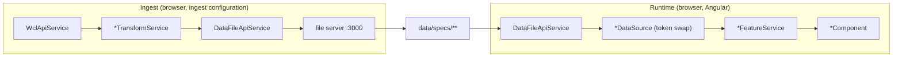

# warcraft-learner

A web-based diagnostic tool for Mythic WoW raiders: it evaluates Warcraft Logs combat data against AI-generated, spec-specific rulebooks and delivers coaching-style feedback benchmarked against top parses. The app is a **fully static Angular SPA** on GitHub Pages - no backend, all analysis client-side, WCL queried directly from the browser with an OAuth2 client-credentials token (no user login).

## Always-on rules

- **Never use em-dashes (U+2014), en-dashes (U+2013), the Unicode minus (U+2212), or the middle dot (U+00B7)** anywhere - docs, code comments, commit messages, UI copy, generated output. Use a plain ASCII hyphen (`-`) or rephrase.
- **Describe only current behavior, never past behavior.** Docs, skill files, and code comments state what the code does now - never "previously...", "was removed", "no longer...", or a contrast against a prior approach. Change history lives in git, not in the source.
- **Comment the why, not the what - one line or none.** A comment exists only if you can name the specific, concrete mistake a competent reader makes *without* it (feeds this id to a spell lookup); otherwise delete it. Never restate the code, JSDoc included.

## Architecture at a glance

The layout is domain-oriented: module types over the Angular style guide's feature-area folders. One business domain, `raid-analysis`, plus the technical `shared` domain, each split into the four module types: `feature-*` (a use case's smart components), `ui-*` (presentational components and pipes), `data` (the domain model and every service operating on it: WCL and data-file access, transforms, the per-feature `*FeatureService`s, analysis math, selection state) and `util-*` (technical helpers). Everything directly under `src/app/` outside `domains/` is the shell (the routed pages and the nav) and may reach anything. Access, eslint-enforced (`frontend/eslint.config.js`): feature -> ui, data, util; ui -> ui, data, util; data -> util; util -> util; a domain reaches only itself and `shared`.

Behavior is implemented as methods on `@Injectable` services - stateless, data in, data out (eslint-enforced); exactly **three pass-through API services** (`WclApiService`, `DataFileApiService`, `SimcDataService`) do IO. Ingestion is the same Angular app booted with the `ingest` configuration (`feature-ingest`), driving the same `*TransformService`s and persisting through a micro file server to `frontend/public/data/specs/**`. The same app in rulebook mode (`mode=rulebooks`) derives each spec's `rulebook.json` deterministically from SimulationCraft's profile and spell data plus sampled top parses (`data/simc`, `data/rulebook-build`):

Bench data and rulebooks live only on `gh-pages` under `data/specs/`, written by the ingest workflow; code deploys write `main/` and `pr-N/` beside it.

## Commands (run from `frontend/`)

| Command | Description |
|---|---|
| `npm start` | Angular dev server on http://localhost:4200 |
| `npm run build` | Production build to `../static/angular/` |
| `npm test` | `ng test` (Vitest, the one unit-test suite) |
| `npm run e2e` | Playwright suite over both pages, run by the E2E workflow on every PR push; never locally, as each run spends one WCL analysis |
| `npm run lint` | `ng lint` over `src/**` then `eslint` over `scripts/**`, `e2e/**`, and the Playwright config |
| `npm run knip` | Dead-code check: unused files, exports, and dependencies (`knip.json`) |
| `npm run schema:pull` | Re-introspect the WCL v2 schema and regenerate `wcl-operations.generated.ts` in one run; commit only the regenerated types |
| `npm run data:pull` | Fetch the shared dataset from `origin/gh-pages` into the ignored working tree |
| `node scripts/ingest-server.js` | Ingest file server on :3000; interactive ingestion is this plus `ng serve --configuration ingest` in a second terminal |
| `npm run ingest` | Headless ingestion (CI entry): starts both of the above, then drives the app in a headless browser |
| `npm run rulebooks` | Headless rulebook build for `RULEBOOK_SPECS` (comma-separated folder keys) from the `SIMC_TIER` profiles (`<branch>/<dir>`, e.g. `midnight/MID2`), sampling `CURRENT_RAIDS` parses; writes `data/specs/{spec}/rulebook.json` |

## Development workflow router

The detailed conventions live in the `warcraft-*` skills under `.claude/skills/`, which load on demand: a skill is matched by its `description`, or you name it explicitly. Load the matching skill(s) before you start the row's work, never from memory of a topic that has a skill.

| When you are... | Load |
|---|---|
| Building or changing any code (finding, rule kind, feature, page, component) | **warcraft-change** |
| Writing or changing any string a user sees | **warcraft-writing** |
| Touching WCL queries, gear / spec / talent / enchant extraction, positions, or `wcl-auth` / the embedded secret | **warcraft-wcl-data** |
| Generating or refreshing a spec's `rulebook.json` | **warcraft-rulebook** |
| Reviewing code, a diff, or a PR | **warcraft-change** (the verification section applies) |

On any conflict between a skill and this file, **this file wins**.
